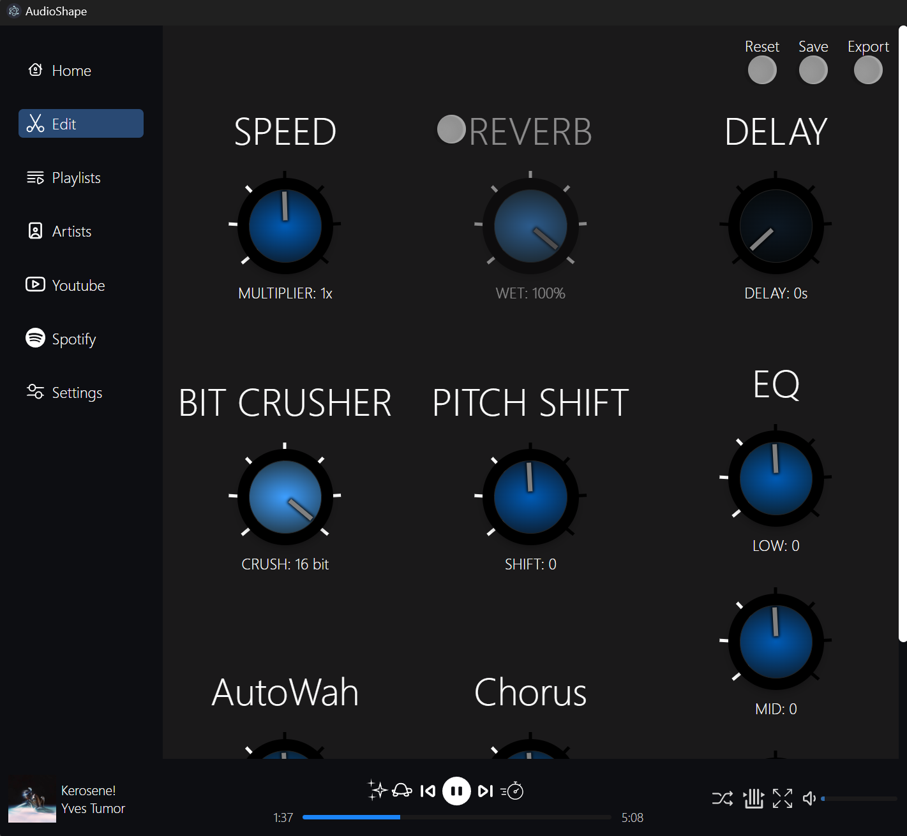

<h1 align="center">
  AudioShape
</h1>

  <h4>
    A music player with built-in audio editing tools
  </h4>

  

      
      
      
  

  

`npm install webpack-cli` 

#### Run webpack

`npm run watch`  
This will create a new folder titled 'build'

#### Build App

`npm run electron-build`
This will create a new folder titled 'dist'. Inside is where the installer.exe is

- If you can't build, make sure react-scripts is not installed

#### Run the app :)

In /dist, run setup.exe  

## Launching

`npm install`
`npm i react-scripts`
`npm run all`

## Testing

To run the tests
`npm test`

To see the coverage
`npx jest --coverage`

## BUGS

1. Fixup all of the addEffect, runEffect stuff
2. Queue display gets out of sync
3. In fullscreen view, the name changes before the song is loaded when using effects

## TODO

1. Change song key to something unique... not duration
2. Loading screens/indicators on everything. (Applying current effect combo, changing songs, etc.)
3. When on song edit screen, the effects get reset when the next song starts. They should stay and be applied to the next song
4. Using remotely - server & remote
5. Caching?
6. Themes and easy support for creating them
7. Addon support
   - Lyrics
   - Themes?
   - Audio edit plugins
8. Add ability to add image ! WILL WRITE TO THAT FILE THEN
9. lazy loading - 'react-window'
10. Need to export to mp3, rn, exporting to WAV is creating audio files x10 as big as their original
11. Start creating the new song before the current ends on auto play so the user doesnt have to wait for it to render
12. Add tailwindCSS, it should reduce a lot of the duplicate CSS. Or not tailwindCSS but just cleanup the CSS.
13. Videos tab. Just another songList but showing only mp4 files... or maybe just filter on songlist screen?
14. Fix how Spotify songs are saved. Right now its doing extra stuff to get the artist. I should send data somehow of the song data (title, artist, album) to be used when its finished downloading from youtube. Maybe just use a callback?
15. What quality are the mp4s being downloaded at from youtube
16. Remove the data-testid tags from the production builds: https://github.com/coderas/babel-plugin-jsx-remove-data-test-id
17. Add a cleanup when the app first starts. To see if there were any songs that weren't somehow deleted

999 Easy file/song sharing
